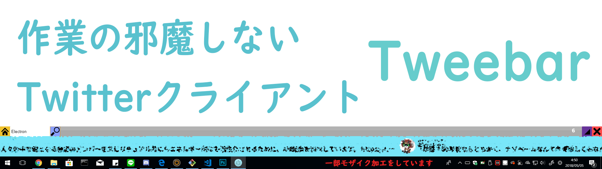

# Tweebar
## A twitter client that does not interfere.



Note: This application is under development.  
It resides on the desktop and the automatic timeline flows automatically so you can see Twitter without disturbing your work.
This is a Twitter client to watch. You can not "tweet", "do" or "like", but you can do a perfect job while watching Twitter!
We will restrict your actions and concentrate on your work.
You can search not only the timeline, but also.

## Require modules
- ipc
```
npm install ipc
```
- node-twitter-api
  - https://github.com/reneraab/node-twitter-api
```
npm install node-twitter-api
```

## Note
All png images (img/*.png) are not pushed. To use this application, please obtain the image yourself. Check `src/css/main.css`. I am using the image of this site.
- http://www.defaulticon.com/

## Run
```
electron app.js
```

# Lisense
MIT