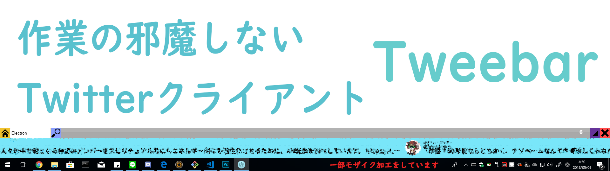

# Tweebar
## 作業の邪魔をしないツイッタークライアント



デスクトップに常駐し、自動タイムラインが自動で流れるので、作業を邪魔することなくツイッターを見ることができます。
自分のタイムラインの他に、検索機能がありますが、ツイート、いいね、リツイートはできません、作業に集中して下さい。

## 必要なパッケージ
- Node js
- Electron
- ipc
```
npm install ipc
```
- node-twitter-api
  - https://github.com/reneraab/node-twitter-api
```
npm install node-twitter-api
```

## 画像について
画像については配布していないので、使いたい場合は各自で用意して、`img`フォルダに入れてください。 `src/css/main.css`に画像のリンクがあります。私はこちらのサイト（http://www.defaulticon.com）から画像をお借りしています。

## 実行
```
electron app.js
```

# ライセンス
MIT